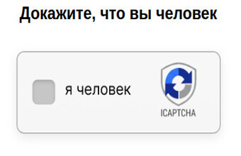

# FlareBypasser
FlareBypasser is a service to bypass Cloudflare and DDoS-GUARD protection,
work to solve the challenge after October 20, 2024.

## How it works

FlareBypasser starts a server, and it waits for user requests.
When some request arrives, it uses [zendriver](https://github.com/stephanlensky/zendriver)
to create a web browser (Chrome). It opens the URL with user parameters and waits until the Cloudflare challenge
is solved (or timeout). The cookies are sent back to the user, and those cookies can be used to
bypass Cloudflare using other HTTP clients.
FlareBypasser don't use intrusive methods (DOM change, including shadow-root mode change) and
don't use driver specific abilities (shadow-root navigation), it search challenge position by image processing.

This solution allows you to bypass the flare challenge and similar visual challenges, like this:


But for some specific challenges need to extend _CHALLENGE_TITLES or _CHALLENGE_SELECTORS for detect
the presence of captcha on the site.

## Installation

### Docker

It is recommended to install using a Docker container because the project depends on an external browser that is
already included within the image.

We provide a `docker-compose.yml` configuration file. Clone this repository and execute
`docker compose up -d` to start
the container. The server listens on **port 8080** inside the container by default (mapped to 20080 on the host). To use a different port, set the `PORT` environment variable (e.g. `PORT=3000`) and adjust the `ports` mapping in `docker-compose.yml` (e.g. `20080:3000`).

### From github as pip package
> **Warning**
> Installing as package only works for x64 architecture. For other architectures see Docker images.

* Install [Python >=3.9](https://www.python.org/downloads/).
* Install [Chrome](https://www.google.com/intl/en_us/chrome/) (all OS) or [Chromium](https://www.chromium.org/getting-involved/download-chromium/) (just Linux, it doesn't work in Windows) web browser.
* (Only in Unix) Install [Xvfb](https://en.wikipedia.org/wiki/Xvfb) package:</br>
`sudo apt-get install xvfb` on Debian based Unix.</br>
`sudo yum install xorg-x11-server-Xvfb` on Linux based Unix.
* (Only in macOS) Install [XQuartz](https://www.xquartz.org/) package.
* If you plan to use proxy with authorization : install [gost](https://github.com/ginuerzh/gost).
* Run `pip install git+https://github.com/yoori/flare-bypasser.git`.
* Run `flare_bypass_server` command to start FlareBypasser. The server binds to `127.0.0.1:8000` by default. Set the `PORT` environment variable to use another port (e.g. `PORT=8080`).

### From source code

> **Warning**
> Installing from source code only works for x64 architecture. For other architectures see Docker images.

* Install [Python >=3.9](https://www.python.org/downloads/).
* Install [Chrome](https://www.google.com/intl/en_us/chrome/) (all OS) or [Chromium](https://www.chromium.org/getting-involved/download-chromium/) (just Linux, it doesn't work in Windows) web browser.
* (Only in Unix) Install [Xvfb](https://en.wikipedia.org/wiki/Xvfb) package:</br>
`sudo apt-get install xvfb` on Debian based Unix.</br>
`sudo yum install xorg-x11-server-Xvfb` on Linux based Unix.
* (Only in macOS) Install [XQuartz](https://www.xquartz.org/) package.
* If you plan to use proxy with authorization : install [gost](https://github.com/ginuerzh/gost).
* Clone this repository.
* Run `pip install .` (from project root).
* Run `flare_bypass_server` command to start FlareBypasser. The server binds to `127.0.0.1:8000` by default. Set the `PORT` environment variable to use another port.

## Usage

**Port:** When run via Docker the server listens on port **8080** (host mapping is 20080 by default). When run via pip/source the default is **8000**. You can set the `PORT` environment variable to change the listen port; with Docker, also set the port mapping (e.g. `ports: - "20080:3000"` if `PORT=3000`). The examples below use `localhost:8080` (Docker); use your port if different.

Example Bash request:
```bash
curl -L -X POST 'http://localhost:8080/v1' \
-H 'Content-Type: application/json' \
--data-raw '{
  "cmd": "request.get",
  "url": "http://www.google.com/",
  "maxTimeout": 60000
}'
```

Example Python request:
```py
import requests

url = "http://localhost:8080/v1"
headers = {"Content-Type": "application/json"}
data = {
    "cmd": "request.get",
    "url": "http://www.google.com/",
    "maxTimeout": 60000
}
response = requests.post(url, headers = headers, json = data)
print(response.text)
```

### Commands

I recommend to use normalized rest API (path per command) - it more strict ... See /docs page after server start.

#### POST `/v1` : cmd = `request.get_cookies` (FlareSolverr compatible API)
#### POST `/get_cookies` (see /docs)

Return cookies after challenge solve. <br />
Don't forget to use userAgent (obtained from the API) in your code when sending request with this cookie. <br />

For sites, that support HTTP/2: I recommend to use library, that support it too.
Because you can get 403 with using HTTP/1.1 if cookie got with using HTTP/2. <br />
Python `requests` library support only HTTP/1.1, you can use [AsyncClient](https://github.com/yoori/flare-bypasser/blob/main/src/flare_bypasser/async_client.py)
or python `httpx` package directly.

Example response:

```json

{
  "status": "ok",
  "message": "Challenge solved!",
  "startTimestamp": 1729525047.104645,
  "endTimestamp": 1729525057.075713,
  "solution": {
    "status": "ok",
    "url": "https://torrentleech.pl/login.php?returnto=%2F",
    "cookies": [
      {"name":"cf_clearance","value":"OvR1ItQg.BERjqCP3x.jLvl0dwt3ryTkYB9ycvoYwPw-1729525048-1.2.1.1-XwfWOOILDSrghfgKcmTWMyaOzg0MX5uhIyRDb9j_E6fgSUCYWWgfgULsMV9OcAtJ74asicOvUgZdgD56k1ryPFh_nWxFdmc547LGkcokXUvtj5DxlIo5mqK1Wk7TgEOvj_Sz44_1Jzj41Qsfw57WIfu9wpDm6aTe0lMZ.8TP5maHGja5bgxtqRRW4gaNCQJpZiLmauclhZnIubERNGziatv_euMp_xXRZUjpOygGOzDyL7w3PeN0P2HTZTl8IIcGSOktE3ryRyyysWcoIlnLiBTcoGrjOM3Av6TrvYlDkqhrZwmsbKNrRpfjfaUDClz.w1_SbS0rMLLJ7isxqUdT92RhdWcPD6aANKOpoqdAu7povEGC8pghVMgo7vLu4CBm3nHlmgMSDQgOB6L2XiHMBuPJdMAq_wkfqcqITl1qfo8","port":null,"domain":".torrentleech.pl","path":"/","secure":true},
      {"name":"PHPSESSID","value":"uk4uefb5p8njsjcbpea1plpl45","port":null,"domain":"torrentleech.pl","path":"/","secure":false}
    ],
    "userAgent":"Mozilla/5.0 (X11; Linux x86_64) AppleWebKit/537.36 (KHTML, like Gecko) Chrome/130.0.0.0 Safari/537.36",
    "response": null,
    "version": "0.1.54"
  }
}

```

#### POST `/v1` : cmd = `request.get` (FlareSolverr compatible API)
#### POST `/get_page` (see /docs)

Returns cookies and page content (in response field) after challenge solve.

#### POST `/v1` : cmd = `request.post` (FlareSolverr compatible API)
#### POST `/make_post` (see /docs)

Send POST request (with using form). Need to pass postData parameter value.

### Advanced Usage
In some cases you need to make some specific actions on page after challenge solving (click, fill form, ...).
For this case you can implement own command over extension - see [examples/custom_user_commands](https://github.com/yoori/flare-bypasser/tree/main/examples/custom_user_commands)
